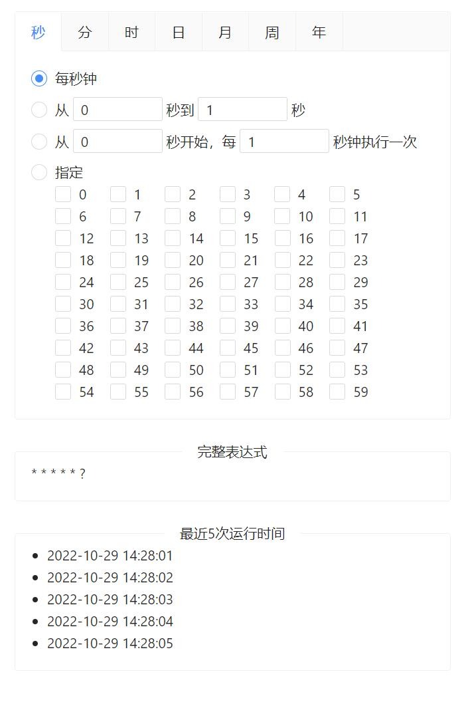

# vue3-cron

基于 `Vue3` 和 `ant-design-vue` 的 Cron 表达式 UI 组件.

[English](./README.md) | 简体中文

## 预览



## 支持的语法

```
*    *    *    *    *    *    *
┬    ┬    ┬    ┬    ┬    ┬    ┬
│    │    │    │    │    |    └ year (currentYear - 2099)
│    │    │    │    │    └───── day of week (0 - 7) (0 or 7 is Sun)
│    │    │    │    └────────── month (1 - 12)
│    │    │    └─────────────── day of month (1 - 31)
│    │    └──────────────────── hour (0 - 23)
│    └───────────────────────── minute (0 - 59)
└────────────────────────────── second (0 - 59)
```

| 项  | 是否必填 | 取值范围 | 支持的通配符 |
|----|----|----|----|
| 秒  | 是 | 0-59 | , - * / |
| 分  | 是 | 0-59 | , - * / |
| 时  | 是 | 0-23 | , - * / |
| 日  | 是 | 1-31 | , - * / L W |
| 月  | 是 | 1-12 | , - * / |
| 周  | 是 | 0-7 或者 SUN-SAT | , - * / L # |
| 年  | 否 | 当前年份-2099 | , - * / |

## 安装

```
npm install vue3-cron-antd --save
```

## 使用方法

### 引入

```typescript
import { createApp } from 'vue';
import Vue3Cron from 'vue3-cron';

const app = createApp({
    /* root component options */
});

app.use(Vue3Cron);

app.mount('#app');
```

### 使用

```vue
<template>
    <vue3-cron v-model="expression" />
</template>

<script>
    export default {
        data() {
            return {
                expression: '* * * * * ?',
            };
        },
    }
</script>
```
