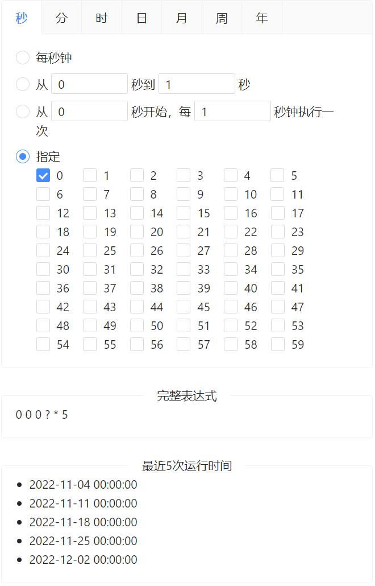

# vue3-cron

A Cron expression UI component based on Vue3 and Ant Design Vue.

English | [简体中文](./README-zh_CN.md)

## Preview



## Supported format

```
*    *    *    *    *    *    *
┬    ┬    ┬    ┬    ┬    ┬    ┬
│    │    │    │    │    |    └ year (currentYear - 2099)
│    │    │    │    │    └───── day of week (0 - 7) (0 or 7 is Sun)
│    │    │    │    └────────── month (1 - 12)
│    │    │    └─────────────── day of month (1 - 31)
│    │    └──────────────────── hour (0 - 23)
│    └───────────────────────── minute (0 - 59)
└────────────────────────────── second (0 - 59)
```

| Field  | Required | Value range             | Allowed wildcard |
|--------|----------|------------------|------------------|
| Second | Yes      | 0-59             | , - * /          |
| Minute | Yes      | 0-59             | , - * /          |
| Hour   | Yes      | 0-23             | , - * /          |
| Date   | Yes      | 1-31             | , - * / L W      |
| Month  | Yes      | 1-12             | , - * /          |
| Week   | Yes      | 0-7 or SUN-SAT   | , - * / L #      |
| Year   | No       | currentYear-2099 | , - * /          |

## Installation

```
npm install vue3-cron --save
```

## Usage

### Import

```typescript
import { createApp } from 'vue';
import Vue3Cron from 'vue3-cron';

const app = createApp({
    /* root component options */
});

app.use(Vue3Cron);

app.mount('#app');
```

### Use

```vue
<template>
    <vue3-cron v-model="expression" />
</template>

<script>
    export default {
        data() {
            return {
                expression: '* * * * * ?',
            };
        },
    }
</script>
```
